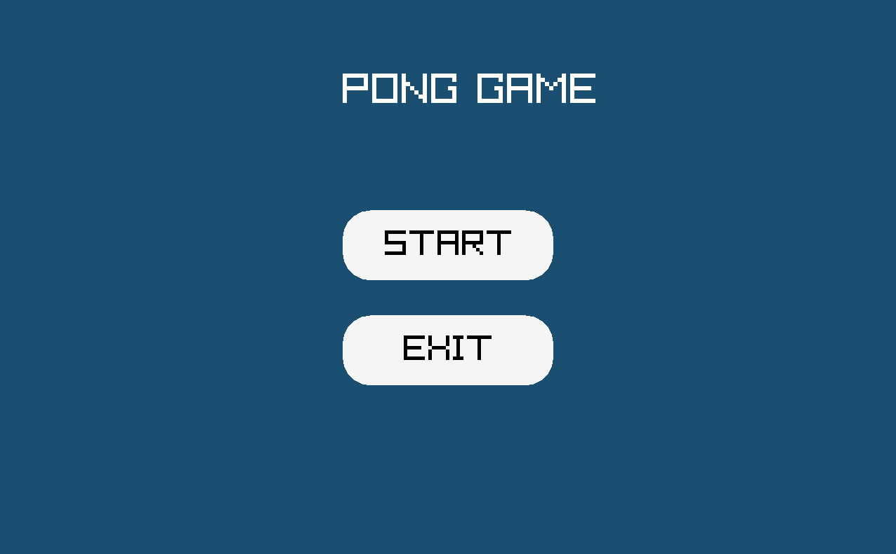

# 🏓 Pong Game in C++ using raylib

A classic Pong game built using C++ and the [raylib](https://www.raylib.com/) graphics library.  
This project was created as a fun way to explore game development and practice object-oriented programming.

---

## 🎮 Features

- Classic Pong gameplay
- CPU vs Player mode
- Smooth animations and transitions
- Clean and responsive UI
- Interactive menu with Start and Exit buttons

---

## 🕹️ Controls

- `↑` Arrow Key – Move paddle up  
- `↓` Arrow Key – Move paddle down  
- `Space` – Return to menu during gameplay  
- Mouse click – Interact with menu buttons

---

## Game Preview




---

## 🛠️ Technologies Used

- **Language:** C++  
- **Library:** raylib  
- **IDE:** Visual Studio 2022

---

## 🚀 How to Run

1. Clone the repository:
   ```bash
   git clone https://github.com/YourUsername/PongGame.git
   cd PongGame
